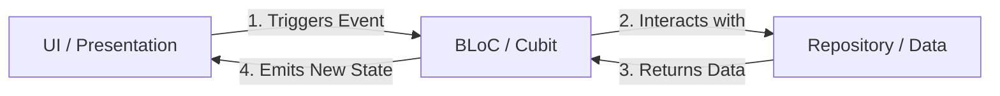

# Mastering BLoC State Management in Flutter

Welcome to the BLoC state management guide! This document is designed to get you fully up to speed on the **BLoC (Business Logic Component)** pattern using the `flutter_bloc` library. 

By the end of this guide, you will understand the differences between **Cubit** and **Bloc**, how they manage state, and how to write production-grade, maintainable code using both approaches.

---

## 1. What is BLoC?

**BLoC** is a state management pattern that helps separate the **presentation layer** (UI) from the **business logic** (data processing & logic). 

In BLoC, the app's components interact through a stream of **States** and **Events**:
* **Events**: Inputs to the BLoC (e.g., clicking a button, fetching data, typing text).
* **States**: Outputs from the BLoC (e.g., loading, success, error, updated data).



---

## 2. Cubit vs. Bloc: The Two Flavors

The `flutter_bloc` library gives you two ways to implement state management: **Cubit** and **Bloc**.

### Cubit (Simpler, Method-Driven)
A **Cubit** is a simplified version of a BLoC. Instead of receiving events, a Cubit exposes **public methods** (functions) that the UI calls directly. When these methods execute, they **emit** new states.

* **Trigger**: Function calls (e.g., `cubit.loadEvents()`).
* **State Change**: Calling `emit(newState)`.
* **Best For**: Simpler features, local UI state, simple CRUD operations.

```dart
class CounterCubit extends Cubit<int> {
  CounterCubit() : super(0);

  void increment() => emit(state + 1); // Directly called by UI
}
```

### Bloc (Advanced, Event-Driven)
A **Bloc** is fully event-driven. Instead of calling methods directly, the UI **adds events** to the Bloc. The Bloc registers event handlers that listen for these incoming events and map them to outgoing states.

* **Trigger**: Adding events (e.g., `bloc.add(LoadEventsEvent())`).
* **State Change**: Inside event handlers using `emit(newState)`.
* **Best For**: Complex state transitions, event buffering/debouncing/throttling (like search queries), undo-redo logic, highly auditable flows.

```dart
// 1. Define Events
abstract class CounterEvent {}
class CounterIncrementPressed extends CounterEvent {}

// 2. Implement Bloc
class CounterBloc extends Bloc<CounterEvent, int> {
  CounterBloc() : super(0) {
    on<CounterIncrementPressed>((event, emit) {
      emit(state + 1);
    });
  }
}
```

### Quick Comparison Table

| Feature | Cubit | Bloc |
| :--- | :--- | :--- |
| **How UI interacts** | Calls a method (`cubit.doSomething()`) | Dispatches an event (`bloc.add(DoSomething())`) |
| **State transition trigger** | Method invocation | Event stream listener |
| **Complexity** | Low (fewer files, less boilerplate) | Medium to High (requires defining Events) |
| **Advanced event filtering** | Difficult (requires custom logic) | Easy (using `transformer` operators like `debounceTime`) |

| **Traceability** | Good | Excellent (you can log every single event and state transition) |

---

## 3. The flutter_bloc UI Widgets

The library provides several widgets to connect your UI to Cubits and Blocs.

### 1. `BlocProvider`
Used to create and provide a Cubit or Bloc to its children. It handles automatic closing/disposal of the bloc.
```dart
BlocProvider(
  create: (context) => MyBloc(repository: sl()),
  child: const MyWidget(),
)
```

### 2. `BlocBuilder`
Rebuilds its widget subtree whenever the state changes. You must return a widget based on the current state.
```dart
BlocBuilder<MyBloc, MyState>(
  builder: (context, state) {
    if (state is MyLoading) return const CircularProgressIndicator();
    if (state is MyLoaded) return Text(state.data);
    return const SizedBox.shrink();
  },
)
```

### 3. `BlocListener`
Runs a callback (once) when a state changes. **Does not rebuild UI**. Excellent for showing snackbars, navigation, or alert dialogs.
```dart
BlocListener<MyBloc, MyState>(
  listener: (context, state) {
    if (state is MyError) {
      ScaffoldMessenger.of(context).showSnackBar(
        SnackBar(content: Text(state.message)),
      );
    }
  },
  child: const MyWidget(),
)
```

### 4. `BlocConsumer`
Combines `BlocBuilder` and `BlocListener` into a single widget when you need to both rebuild the UI and trigger side-effects (e.g. snackbars, dialogs) on state changes.
```dart
BlocConsumer<MyBloc, MyState>(
  listener: (context, state) {
    // Navigate or show snackbar
  },
  builder: (context, state) {
    // Return widget tree
  },
)
```

### 5. `context` Extension Methods
You can look up Blocs/Cubits in the widget tree using BuildContext:
* `context.read<T>()`: Gets the Bloc instance. Used to trigger events/methods (e.g., in button `onPressed`). **Do not call inside build()**.
* `context.watch<T>()`: Gets the Bloc instance and registers the widget to rebuild whenever state changes. **Can be used inside build()**.
* `context.select<T, R>(R Function(T) selector)`: Watches only a specific part of a state, rebuilding the widget only if that part changes.

---

## 4. Let's Learn By Example: Transitioning from Cubit to Bloc

To see exactly how a Cubit is refactored into an event-driven Bloc, let's examine the **Chat feature** transition in this project.

### Step 1: The Cubit Version (Old)

**Cubit Implementation:**
```dart
class ChatCubit extends Cubit<ChatState> {
  final ChatRepository repository;
  final String eventId;

  ChatCubit({required this.repository, required this.eventId}) : super(ChatInitial());

  Future<void> fetchMessages() async {
    emit(ChatLoading());
    try {
      final messages = await repository.getMessages(eventId);
      emit(ChatLoaded(messages));
    } catch (e) {
      emit(ChatError(e.toString()));
    }
  }
}
```

**UI Trigger:**
```dart
// To fetch messages:
context.read<ChatCubit>().fetchMessages();
```

---

### Step 2: The Bloc Version (New)

With Bloc, we first need to define the **Events** that represent user intentions.

**1. Defining Events (`chat_event.dart`):**
```dart
abstract class ChatEvent extends Equatable {
  const ChatEvent();

  @override
  List<Object?> get props => [];
}

class FetchMessages extends ChatEvent {}

class SendMessage extends ChatEvent {
  final String content;
  const SendMessage(this.content);

  @override
  List<Object?> get props => [content];
}
```

**2. Implementing the Bloc (`chat_bloc.dart`):**
```dart
class ChatBloc extends Bloc<ChatEvent, ChatState> {
  final ChatRepository chatRepository;
  final String eventId;

  ChatBloc({required this.chatRepository, required this.eventId}) : super(ChatInitial()) {
    // Register event handlers
    on<FetchMessages>(_onFetchMessages);
    on<SendMessage>(_onSendMessage);
  }

  Future<void> _onFetchMessages(FetchMessages event, Emitter<ChatState> emit) async {
    emit(ChatLoading());
    try {
      final messages = await chatRepository.getMessages(eventId);
      emit(ChatLoaded(messages));
    } catch (e) {
      emit(ChatError(e.toString()));
    }
  }

  Future<void> _onSendMessage(SendMessage event, Emitter<ChatState> emit) async {
    try {
      final message = await chatRepository.sendMessage(eventId, event.content);
      if (state is ChatLoaded) {
        final currentMessages = (state as ChatLoaded).messages;
        emit(ChatLoaded([...currentMessages, message]));
      } else {
        emit(ChatLoaded([message]));
      }
    } catch (e) {
      // Handle error
    }
  }
}
```

**3. UI Trigger:**
Instead of calling a method directly, the UI dispatches an event using `.add()`:
```dart
// To fetch messages:
context.read<ChatBloc>().add(FetchMessages());

// To send a message:
context.read<ChatBloc>().add(SendMessage(messageText));
```

---

## 5. Best Practices & Tips

1. **Equatability**: Always extend states and events with `Equatable` (or override `==` and `hashCode`). This prevents unnecessary widget rebuilds when identical states are emitted.
2. **Avoid Business Logic in UI**: The UI should only react to states and add events. It should never make decisions like filtering arrays or formatted text calculations, which should live inside the BLoC or Domain Models.
3. **One Event Handler Per Event**: Do not register multiple handlers for the same event type. Always map one event type to one specific handler function.
4. **Use Transformers for Filtering**: If you need to debounce search queries, use RxDart-like operators inside your BLoC setup.
